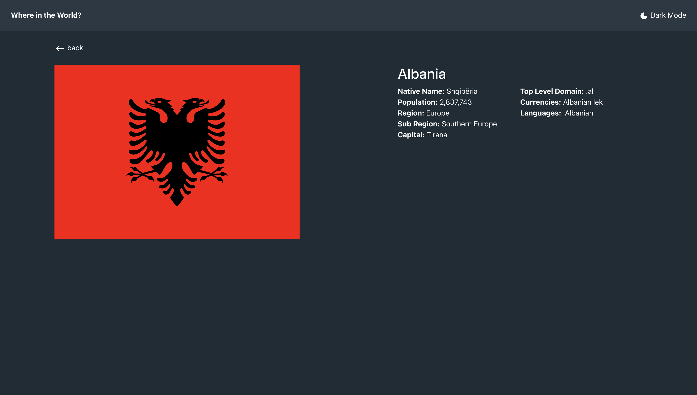

# REST-Countries-API

A website that shows details all information about all countries over the world
# Api sources:
json data file

# About the website

The REST-Countries-API includes the following pages:
(All pages include navbar and footer )

- Home Page 
- country datails Page

# Features

- A website that shows details all information about all countries over the world with day/night mode
- search bar to discover all contries
- regions filter to search by continents

# Technologies Used
- React
- Bootstrap
- CSS

# Screenshots

# Project Link 
https://youssef-eissa.github.io/REST-Countries-API/
